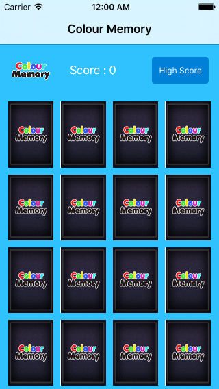
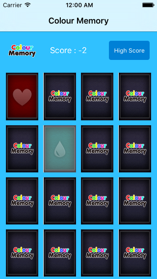
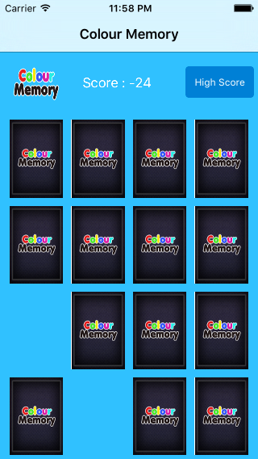
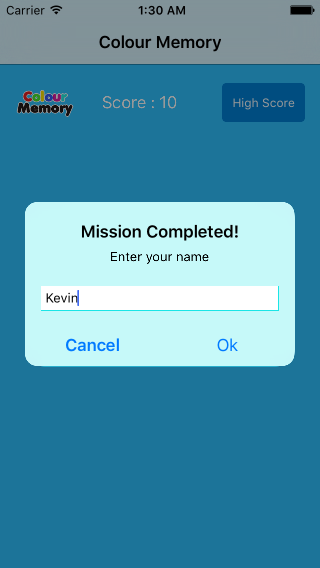

# Colour Memory 
The application is a memory card game where users can select two cards on the game board each round and play the game until all the cards have been matched. If the two cards match, the player gets a point and the cards disappear. If the cards do not match, they will be flipped back over.


# Features 

* This is the main screen that will be shown when users launch the application. There are eight pairs of cards on the game board, the logo, the score label and one button. Users can see their scores via the score label while playing the game.  



* In the upper right-hand corner of the screen, there is a button called 'High Score'. If users tap this button, the app moves to a new screen that shows the player's rank, name and score information in a table.


* Users can select two cards each round. When the user chooses a card, it flips over. If they match, the user gets a point and the cards disappear. If they don't match, the user loses one point and both cards flip back over.





* Once all the cards have been matched, a small screen pops up and users can type their name to submit their score. Once users confirm their names, the app displays the high score table.




*  In the high score table, users can see not only the high score list, but also their current scores and rankings. This screen can be seen in landscape mode, whereas the game board screen can only be seen in portrait mode.


# How to build 

1) Clone the repository 

```
$ git clone https://github.com/woogii/Swift-and-iOS-tutorial.git
$ cd Colour\ Memory/
```

2) Open the workspace in XCode
 
```
$ open Colour\ Memory.xcodeproj/
```

3) Compile and run the app in your simulator 

# Compatibility 
The code of this project works in Swift2.2, Xcode 7.2 and iOS 9.2
